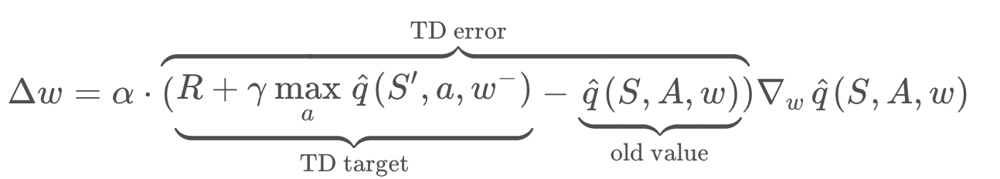
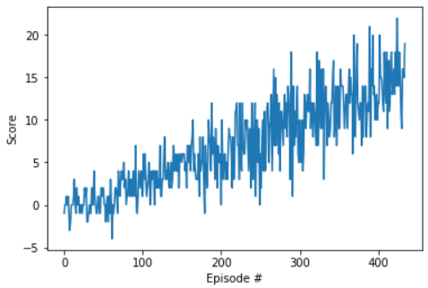

# drln_navigation
Navigation project for UDACITY course Deep Reinforcement Learning


## Learning Algorithm
A DQN agent is trained (agent.py) with fixed Q-targets and experience replay memory of size 10000, where experience tuples of ("state", "action", "reward", "next_state", "done").

An action-value function qnetwork_local is initialized with random weights and targer action-value weights qnetwork_target.

During sampling, the agent chooses an action from current state, observes reward and the next state. This experience is stored in memory (class ReplayBuffer). The action is selected based on epsilon-greedy policy.

During training, random minibatch of experience tuples are sampled from replay memory (uniformly). 

The network is updated every 4 steps to accelerate training using the following update rule:


MSE is used for the TD error and soft update is performed to the model parameters: <br />
θ_target = τ*θ_local + (1 - τ)*θ_target. <br />

Hyperparameters used:
- BUFFER_SIZE = int(1e5)  # replay buffer size
- BATCH_SIZE = 64         # minibatch size
- GAMMA = 0.99            # discount factor
- TAU = 1e-3              # for soft update of target parameters
- LR = 5e-4               # learning rate 
- UPDATE_EVERY = 4        # how often to update the network
- state_size = 37 # number of states
- action_size = 4 # number of actions
- n_episodes=2000 # maximum number of episodes to execute
- max_t=1000 # maximum number of timesteps per episode
- eps_start=1.0 # starting value of epsilon, for epsilon-greedy action selection
- eps_end=0.01 # minimum value of epsilon
- eps_decay=0.995 # multiplicative factor (per episode) for decreasing epsilon

The neural network used consists of 2 linear layers of 128 neurons with dropout layer in between followed by a final linear layer with output the number of possible actions. Input size is 1D array of size equal to state_size. The neural network has the following architecture on pytorch:<br />
```python
QNetwork(
  (fc1): Linear(in_features=37, out_features=128, bias=True)
  (dropout): Dropout(p=0.25)
  (fc2): Linear(in_features=128, out_features=128, bias=True)
  (fc3): Linear(in_features=128, out_features=4, bias=True)
)<br />
```

## Plot of Rewards
Average reward of 13 over 100 epochs is achieved at approximately 335 episodes.


## Ideas for Future Work

- Experimenting with deeper and different architectures along with pre-trained weights.1D convolutional network training was without success.
- In order to deal with the fact that DQN tends to overestimate action values, Double DQN could be employed. The evaluation of the greedy policy should is done according to the online network but using the target network to estimate its value. (https://arxiv.org/abs/1509.06461)
- Using Dueling DQN we can assess the value of each state, without having to learn the effect of each action. Two separate estimators should be implemented: one for the state value function and one for the state-dependent action advantage function. The main benefit of this factoring is to generalize learning across actions without imposing any change to the underlying reinforcement learning algorithm. (https://arxiv.org/abs/1511.06581)
